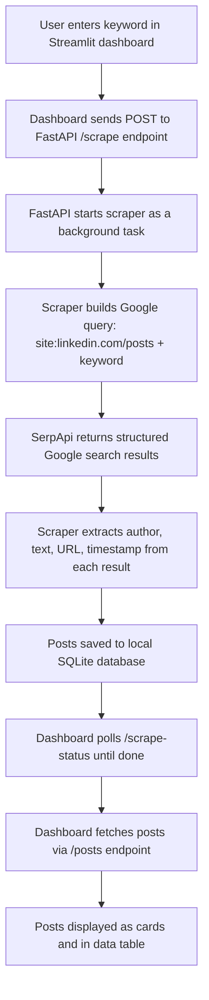

# LinkedIn Post Scout

A tool that lets you search for public LinkedIn posts by keyword, company name, or person and brings them all into a nice dashboard where you can browse, filter, and explore them. It uses Google search results (via SerpApi) to find posts, stores everything locally in a SQLite database, and shows the results through a clean Streamlit dashboard.

No LinkedIn login needed. No cloud hosting. Everything runs on your machine.


## What It Actually Does

You type in a keyword (like "Adya AI" or "Microsoft" or someone's name), and the app goes and searches Google for public LinkedIn posts matching that term. It grabs the author name, the post text, the timestamp, and the original LinkedIn URL for each result. All of that gets saved into a small database file so you can come back to it later. The dashboard then lets you browse the posts as cards, search through them, filter by keyword, and view them in a table.

You can run multiple searches with different keywords and everything accumulates in the same database. Duplicates are automatically skipped based on the post URL.


## How It Works (The Flow)

Here is a quick overview of how data moves through the system, from your search query all the way to the dashboard:

```
You type a keyword in the dashboard
        |
        v
Dashboard sends a request to the FastAPI server (localhost:8000)
        |
        v
FastAPI triggers the scraper in the background
        |
        v
Scraper sends a Google search query to SerpApi
    (something like: site:linkedin.com/posts "Adya AI")
        |
        v
SerpApi returns structured JSON results from Google
        |
        v
Scraper parses each result:
    extracts author name, post text, URL, timestamp
        |
        v
Parsed posts get saved to a local SQLite database
    (duplicates are skipped automatically)
        |
        v
Dashboard polls the API for status updates
        |
        v
Once scraping is done, dashboard fetches all posts from the database
        |
        v
Posts are rendered as cards with author badges,
    date tags, keyword labels, and links to the original LinkedIn post
```

And here is the same thing as a proper diagram if that helps:




## Tech Stack

Here is what the project uses and why:

**SerpApi** handles the Google searching. LinkedIn does not have a public post search API, and scraping Google directly is unreliable (CAPTCHAs, IP blocks, layout changes). SerpApi gives you clean JSON results from Google. Free tier gives you 100 searches per month.

**FastAPI** is the backend API server. It sits between the dashboard and the scraper/database. It handles triggering scrapes, serving post data, and reporting scrape status. It runs on port 8000.

**Streamlit** is the frontend dashboard framework. It makes it really easy to build data focused web apps in pure Python. No JavaScript, no HTML templates to manage. The dashboard runs on port 8501.

**SQLite** is the database. It is just a single file (linkedin_data.db) in the project folder. No database server to install, no configuration. It just works.

**python-dotenv** loads the SerpApi key from a .env file so you do not have to hardcode it anywhere.


## Project Structure

```
Linkedin-Scraper/
|
|   .env                         Your SerpApi key goes here
|   requirements.txt             Python dependencies
|   linkedin_data.db             SQLite database (created automatically)
|   README.md                    This file
|
|   api/
|       main.py                  FastAPI server with all endpoints
|
|   scraper/
|       linkedin_scraper.py      SerpApi scraper with pagination and CLI support
|
|   database/
|       db_manager.py            SQLite helper functions (init, save, query, clear)
|
|   dashboard/
|       app.py                   Streamlit dashboard (main entry point)
|       styles.py                All custom CSS for the dashboard theme
|       api_client.py            HTTP helpers that talk to the FastAPI backend
|       how_it_works.py          Content for the "How it works" dialog and FAQ
```

The dashboard code was recently refactored. It used to be one big 550 line app.py file, but now the styling, API helpers, and informational content each live in their own module. The app still runs exactly the same way, the code is just easier to read and maintain.


## Prerequisites

Before you start, you will need two things:

**Python 3.9 or newer.** You probably already have this. You can check by running `python --version` in your terminal.

**A SerpApi key.** Go to [serpapi.com](https://serpapi.com/) and sign up for a free account. The free plan gives you 100 searches per month, which is plenty for normal use. Each "page" of results you fetch costs one search credit.


## Setup (First Time)

Open a terminal in the project folder and run these commands:

```bash
# Create a virtual environment
python -m venv venv

# Activate it (Windows)
.\venv\Scripts\Activate

# Activate it (macOS or Linux)
# source venv/bin/activate

# Install all the dependencies
pip install -r requirements.txt
```

Next, open the `.env` file in the project root. It should have a line like this:

```
SERPAPI_KEY=your_key_here
```

Replace `your_key_here` with the API key you got from SerpApi. Save the file.

That is it for setup. You only need to do this once.


## Running the App

You need two things running at the same time: the API server and the dashboard. Open two separate terminals for this.

**Terminal 1: Start the API server**

```bash
# Make sure you are in the project root folder
# Make sure the virtual environment is activated

python api/main.py
```

You should see output saying the server is running on `http://0.0.0.0:8000`. Leave this terminal open.

**Terminal 2: Start the dashboard**

```bash
# Open a new terminal window
# Navigate to the project folder
# Activate the virtual environment again

streamlit run dashboard/app.py
```

This will open the dashboard in your browser at `http://localhost:8501`. If it does not open automatically, just go to that URL manually.

Now you can use the sidebar to type in a keyword and hit "Start Scraping". The app will search, save the results, and show them on the dashboard.


## API Endpoints

If you want to interact with the API directly (or build something on top of it), here are the available endpoints:

| Endpoint | Method | What it does |
|---|---|---|
| `/` | GET | Returns a welcome message, just to confirm the API is running |
| `/posts` | GET | Returns posts from the database. Supports `search`, `query_filter`, and `limit` as query params |
| `/scrape` | POST | Triggers a new scrape. Send a JSON body with `query` (string) and `max_pages` (int) |
| `/scrape-status` | GET | Returns the current state of the scraper (running, last count, errors) |
| `/queries` | GET | Returns a list of all the keywords you have searched for so far |
| `/clear` | DELETE | Deletes all posts from the database |


## Using the Scraper from the Command Line

You do not have to use the dashboard to scrape. You can also run the scraper directly from the terminal if you prefer:

```bash
# Scrape posts about "Adya AI" (1 page, about 10 results)
python scraper/linkedin_scraper.py -q "Adya AI" -p 1

# Scrape posts about Microsoft (3 pages, about 30 results)
python scraper/linkedin_scraper.py -q "Microsoft" -p 3

# Scrape posts mentioning someone's name
python scraper/linkedin_scraper.py -q "Pratyush" -p 2
```

The results get saved to the same database, so they will show up in the dashboard the next time you open it.


## How Many Posts Can You Get

Each page of results gives you roughly 10 posts. The free SerpApi plan allows 100 searches per month. So in a month you could scrape up to about 1000 posts across various keywords.

Google rarely returns more than 100 to 300 results for any single query, so even if you set a very high page count, there is a natural ceiling.

All posts accumulate in the database. There is no limit on how many total posts you can store. Run different keyword searches over time and the database keeps growing.


## Limitations and Things to Know

**It only finds public posts.** If someone's post is set to connections only, or their profile is private, Google will not have indexed it and the scraper will not find it.

**Author names are not always perfect.** The author name is extracted from Google's search result titles and snippets, not from LinkedIn directly. Google sometimes truncates or reformats things in a way that makes the name hard to parse. The scraper tries several patterns but it is not 100% accurate.

**Timestamps are best effort.** When possible, the app decodes the timestamp from the LinkedIn activity ID embedded in the post URL. This gives an exact date. When that is not available, it falls back to Google's date field or tries to parse a date from the snippet text. Some posts will just show "Date not available".

**SerpApi credits are consumed per page.** If you set max pages to 3, that uses 3 credits from your monthly quota. Be mindful of this if you are on the free tier.


## Future Improvements

Here are some features and improvements that could be added down the line:

**Sentiment analysis.** Run each post through a simple NLP model or an LLM API to classify whether the sentiment is positive, negative, or neutral. This would let you gauge public perception of a brand or person over time.

**Scheduled scraping.** Right now you have to manually trigger each scrape. It would be useful to set up a scheduler (like APScheduler or a cron job) that automatically scrapes certain keywords on a daily or weekly basis, so your database stays up to date without you having to think about it.

**Export to CSV or Excel.** The data table is viewable in the dashboard, but it would be nice to have a one click export button that downloads all filtered posts as a CSV or Excel file for offline analysis.

**Charts and analytics.** Add visualizations like a timeline chart showing how many posts were published per week, a bar chart of the most frequent authors, or a word cloud of common terms. Streamlit has built in charting support so this would not be too hard.

**Multi keyword comparison.** Let users compare two or more keywords side by side. For example, see how many posts mention "Adya AI" versus "OpenAI" in the same time period, with separate metrics for each.

**Post engagement data.** Right now we only get the post text and author. If LinkedIn makes engagement data (likes, comments, reposts) available through any indexable channel, it would add a lot of value to include those numbers.

**Full text search improvements.** The current search is a simple SQL LIKE query. Replacing it with something like SQLite FTS5 (full text search) would make filtering faster and support more advanced queries like phrase matching and ranking by relevance.

**Notification system.** Set up alerts for specific keywords. For example, get an email or a Slack message whenever a new post mentioning your company name appears in the database.

**User authentication.** If the app is ever deployed for a team (not just local use), adding basic auth or SSO would keep the data private and the scrape controls limited to authorized users.

**Dockerized deployment.** Wrap the whole thing (API, dashboard, database) into a Docker Compose setup so anyone can spin it up with one command without worrying about Python versions, virtual environments, or dependencies.


## Contributing

If you want to improve or extend this project, the code is straightforward to work with. The project is modular: scraper logic, database logic, API logic, and dashboard code are all in separate folders. Change one without breaking the others.

If you find a bug or have a feature idea, feel free to open an issue or submit a pull request.


## License

This project is for personal and educational use. If you plan to use SerpApi in production, make sure you review their terms of service and pick an appropriate plan.
