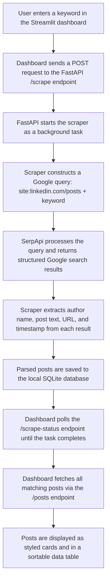

# LinkedIn Post Scout

**Author:** Sakshi Pathak

A tool for searching, collecting, and exploring public LinkedIn posts by keyword, company name, or person. It leverages Google search results through SerpApi to discover posts, stores everything locally in a SQLite database, and presents the data through a clean Streamlit dashboard with filtering, search, and card based browsing.

No LinkedIn login required. No cloud hosting. Everything runs locally.

---

## Table of Contents

1. [Overview](#overview)
2. [How It Works](#how-it-works)
3. [Tech Stack](#tech-stack)
4. [Project Structure](#project-structure)
5. [Prerequisites](#prerequisites)
6. [Installation](#installation)
7. [Running the Application](#running-the-application)
8. [API Reference](#api-reference)
9. [Command Line Usage](#command-line-usage)
10. [Capacity and Limits](#capacity-and-limits)
11. [Known Limitations](#known-limitations)
12. [Future Improvements](#future-improvements)
13. [Contributing](#contributing)
14. [License](#license)

---

## Overview

The application allows a user to enter a keyword (such as "Adya AI", "Microsoft", or a person's name) and it searches Google for public LinkedIn posts matching that term. For each result, the author name, post text, timestamp, and original LinkedIn URL are extracted and saved into a local database. The dashboard then presents these posts as styled cards with author badges, date tags, and keyword labels, along with a searchable data table view.

Multiple searches with different keywords can be run over time and the results accumulate in the same database. Duplicate posts are automatically skipped based on the post URL.

---

## How It Works

The following diagram illustrates the complete data flow, from the initial search query entered in the dashboard all the way to the rendered post cards:



**Step by step breakdown:**

1. A keyword is entered in the dashboard sidebar and the "Start Scraping" button is clicked.
2. The dashboard sends a request to the FastAPI backend, which triggers the scraper as a background task.
3. The scraper constructs a Google search query scoped to `linkedin.com/posts` and sends it to SerpApi.
4. SerpApi returns structured JSON results. The scraper parses each result to extract the author name, post content, timestamp, and original LinkedIn URL.
5. The parsed posts are saved to a local SQLite database. Posts with duplicate URLs are skipped automatically.
6. The dashboard polls the API for status updates and, once complete, fetches and renders all posts.

---

## Tech Stack

| Technology | Role |
|---|---|
| **SerpApi** | Handles Google searching. LinkedIn does not offer a public post search API, and scraping Google directly is unreliable due to CAPTCHAs and IP blocks. SerpApi provides clean, structured JSON results. The free tier includes 100 searches per month. |
| **FastAPI** | Serves as the backend API layer between the dashboard and the scraper/database. Handles triggering scrapes, serving post data, and reporting scrape status. Runs on port 8000. |
| **Streamlit** | Powers the frontend dashboard. It enables building data focused web applications in pure Python without needing JavaScript or HTML templates. Runs on port 8501. |
| **SQLite** | Provides lightweight local storage as a single file (`linkedin_data.db`). No database server installation or configuration is needed. |
| **python-dotenv** | Loads the SerpApi key from a `.env` file to avoid hardcoding credentials. |

---

## Project Structure

```
LinkedIn-post-Scraper/
|
|   .env.example                 Template for environment variables
|   .gitignore                   Files and folders excluded from version control
|   requirements.txt             Python dependencies
|   linkedin_data.db             SQLite database (auto generated, gitignored)
|   README.md                    Project documentation
|   LICENSE                      MIT License
|
|   api/
|       main.py                  FastAPI server with all endpoints
|
|   scraper/
|       linkedin_scraper.py      SerpApi based scraper with pagination and CLI support
|
|   database/
|       db_manager.py            SQLite helper functions (init, save, query, clear)
|
|   dashboard/
|       app.py                   Streamlit dashboard entry point
|       styles.py                Centralised custom CSS for the dashboard theme
|       api_client.py            HTTP client helpers for communicating with the FastAPI backend
|       how_it_works.py          Content for the informational dialog and FAQ section
```

The dashboard is structured as a modular package. Styling, API communication, and informational content are separated into their own files, keeping the main `app.py` focused on layout and flow.

---

## Prerequisites

The following are required before setup:

1. **Python 3.9 or newer.** The installed version can be verified by running `python --version` in a terminal.

2. **A SerpApi API key.** A free account can be created at [serpapi.com](https://serpapi.com/). The free plan provides 100 searches per month, which is sufficient for regular use. Each page of search results consumes one API credit.

---

## Installation

All commands should be run from the project root directory.

```bash
# Create a virtual environment
python -m venv venv

# Activate the virtual environment (Windows)
.\venv\Scripts\Activate

# Activate the virtual environment (macOS / Linux)
# source venv/bin/activate

# Install dependencies
pip install -r requirements.txt
```

Next, create a `.env` file in the project root by copying the provided template:

```bash
cp .env.example .env
```

Open the `.env` file and replace `your_serpapi_key_here` with the actual API key obtained from SerpApi.

This setup only needs to be done once.

---

## Running the Application

The application consists of two services that need to run simultaneously: the API server and the dashboard. Two separate terminal windows are required.

**Terminal 1: Start the API server**

```bash
python api/main.py
```

The server will start on `http://localhost:8000`. This terminal should remain open.

**Terminal 2: Start the dashboard**

```bash
streamlit run dashboard/app.py
```

The dashboard will open automatically in the default browser at `http://localhost:8501`. If it does not open automatically, the URL can be visited manually.

Once both services are running, keywords can be entered in the sidebar and scraping can be triggered directly from the dashboard interface.

---

## API Reference

The following endpoints are available on the FastAPI backend:

| Endpoint | Method | Description |
|---|---|---|
| `/` | GET | Returns a welcome message confirming the API is running |
| `/posts` | GET | Returns posts from the database. Accepts optional query parameters: `search`, `query_filter`, `limit` |
| `/scrape` | POST | Triggers a new background scrape. Expects a JSON body with `query` (string) and `max_pages` (integer) |
| `/scrape-status` | GET | Returns the current scraper state including running status, last result count, and any errors |
| `/queries` | GET | Returns a list of all distinct keywords that have been searched |
| `/clear` | DELETE | Deletes all posts from the database |

---

## Command Line Usage

The scraper can also be used independently from the terminal without the dashboard:

```bash
# Search for posts mentioning "Adya AI" (1 page, approximately 10 results)
python scraper/linkedin_scraper.py -q "Adya AI" -p 1

# Search for posts about Microsoft (3 pages, approximately 30 results)
python scraper/linkedin_scraper.py -q "Microsoft" -p 3

# Search for posts mentioning a specific person
python scraper/linkedin_scraper.py -q "Pratyush" -p 2
```

Results are saved to the same SQLite database and will appear in the dashboard the next time it is opened.

---

## Capacity and Limits

Each page of search results yields approximately 10 posts. The SerpApi free tier allows 100 searches per month, which translates to roughly 1,000 posts across various keywords per month.

Google typically does not return more than 100 to 300 results for any single query, so there is a natural ceiling regardless of the page count setting.

All posts accumulate in the local database with no storage limit. Running different keyword searches over time builds up a growing collection of posts.

---

## Known Limitations

**Public posts only.** Posts that are restricted to connections only, or belong to private profiles, are not indexed by Google and therefore cannot be discovered by the scraper.

**Author name accuracy.** Author names are extracted from Google's search result titles and snippets rather than from LinkedIn directly. Google occasionally truncates or reformats titles, which can result in imperfect name extraction. The scraper applies multiple parsing patterns but 100% accuracy is not guaranteed.

**Timestamp precision.** When possible, timestamps are decoded from the LinkedIn activity ID embedded in the post URL, which gives an exact date. When this is unavailable, the system falls back to Google's date field or attempts to parse dates from snippet text. Some posts may display "Date not available".

**API credit consumption.** Each page of results uses one SerpApi credit. Setting max pages to 3 consumes 3 credits from the monthly quota.

---

## Future Improvements

The following features and enhancements could be added to extend the project:

**Sentiment Analysis.** Each post could be processed through an NLP model or LLM API to classify sentiment as positive, negative, or neutral. This would enable tracking public perception of a brand or individual over time.

**Scheduled Scraping.** A scheduler (such as APScheduler or a cron job) could be integrated to automatically run scrapes for specified keywords on a daily or weekly basis, keeping the database current without manual intervention.

**Export Functionality.** A one click export button could be added to the dashboard to download filtered posts as CSV or Excel files for offline analysis.

**Charts and Analytics.** Visualizations such as timeline charts (posts per week), author frequency bar charts, or word clouds of common terms could be added. Streamlit includes built in charting support that makes this straightforward to implement.

**Multi Keyword Comparison.** A comparison view could allow side by side analysis of two or more keywords, showing separate metrics for each within the same time period.

**Post Engagement Data.** If LinkedIn makes engagement metrics (likes, comments, reposts) available through any indexable channel, incorporating those numbers would add significant analytical value.

**Full Text Search.** The current search uses a simple SQL LIKE query. Upgrading to SQLite FTS5 (full text search) would enable faster filtering, phrase matching, and relevance based ranking.

**Notification System.** Alerts could be configured for specific keywords, sending email or Slack notifications whenever new posts matching those terms appear in the database.

**User Authentication.** For team deployments, basic authentication or SSO could be added to restrict access to authorized users.

**Dockerized Deployment.** The entire stack (API, dashboard, database) could be packaged into a Docker Compose configuration, allowing anyone to launch the application with a single command regardless of their local Python setup.

---

## Contributing

The project is modular by design. Scraper logic, database operations, API endpoints, and dashboard code each reside in separate directories and can be modified independently.

Bug reports, feature suggestions, and pull requests are welcome.

---

## License

This project is licensed under the [MIT License](LICENSE).

Copyright (c) 2026 Sakshi Pathak
